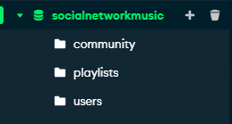

<style>
@import url('https://fonts.googleapis.com/css?family=Inconsolata&display=swap');
  body{
    font-family: 'Inconsolata', monospace;
  }
  h1 {
    color: #FFA07A; 
  }

  h2 {
    color: #98FB98; 
  }

  h3 {
    color: #87CEEB; 
  }

  h4 {
    color: #FFD700; 
  }

  h5 {
    color: #FFB6C1; 
  }

  h6 {
    color: #9370DB; 
  }
</style>

# Introduzione

Questo documento rappresenta la relazione del progetto "Social Network for Music", sviluppato nel contesto del corso "Programmazione e Linguaggi per il Web" durante l'anno accademico 2023.

### Autori
Il progetto è stato realizzato da:

- [Alessandro Riemer](https://github.com/FriendlyWizard23) (Matricola: 941878)
- [Kevin Manca](https://github.com/kevinm6) (Matricola: 941878)

### Link ed informazioni utili
- è disponibile una demo (AWS hosted) presso <a href="http://16.171.137.111:3000/">questo link</a>
- La pagina GitHub del progetto si trova a <a href="https://github.com/kevinm6/progettoTLW">questo link</a>
# Struttura dell'Applicazione

## Front-End
> **Front End:** 
Il Front-End è la parte dell'applicazione che si occupa dell'interfaccia utente e dell'interazione con l'utente. Si concentra sulla progettazione e sull'implementazione dell'aspetto visivo dell'applicazione e sulla gestione delle interazioni utente.

All'interno della directory /src/html/, sono presenti i seguenti elementi principali:

- **Elementi HTML**: Questi file definiscono l'interfaccia grafica dell'applicazione, determinando come l'applicazione appare nel browser.

- **/css/**: Questa directory contiene i file di stile che definiscono l'aspetto visivo dell'applicazione. Alcuni dei file principali includono:
  - /src/html/css/confirmationmodal.css
  - /src/html/css/default.css
  - /src/html/css/explore.css

- **/src/scripts/**: Questa directory contiene file JavaScript (JScript) che gestiscono la logica del Front-End. Alcuni dei file principali includono:
  - /src/html/community.html
  - /src/html/createcommunity.html
  - /src/html/createplaylist.html
  - /src/html/editplaylist.html
  - /src/html/explore.html
  - /src/html/login.html
  - /src/html/playlist.html
  - /src/html/profile.html
  - /src/html/register.html
  - /src/html/search.html

La suddivisione chiara tra file HTML, file CSS e file JavaScript (JScript) consente una gestione efficiente del Front-End e garantisce un'esperienza utente di alta qualità.

Per ulteriori dettagli sull'implementazione del Front-End, si rimanda alle specifiche sezioni dei file e dei componenti menzionati sopra.

## Back-End
> **Back End:** 
Il Back-End è responsabile delle funzionalità e della logica dell'applicazione lato server. Esso comprende una serie di elementi chiave presenti nella nostra struttura di lavoro. Possiamo suddividere il backend in 3 sezioni principali

### NODEJS
#### COS'E' NODEJS ED  EXPRESS
**Node.js** ed **Express** costituiscono un binomio potente nell'ambito dello sviluppo web di applicazioni scalabili ed efficienti. <br>*Node.js* fornisce un ambiente runtime JavaScript server-side, ottimizzato per l'efficienza e la scalabilità. 
<br>*Express*, un framework web basato su Node.js, semplifica la creazione di applicazioni web, offrendo funzionalità come la gestione delle richieste HTTP e dell'autenticazione. 

#### FILE NODEJS

- **/serverlogs/**: Questa directory contiene il file di log 'serverlogs.log', che registra i log del server per monitorare il suo funzionamento e le policy associate.

- **/src/api/docs/**: In questa directory sono presenti i file utilizzati per la gestione della documentazione pubblica delle nostre API, inclusi:
  - swagger.js
  - swagger_output.js

- **/src/config/**: Questa cartella contiene i file dedicati alla configurazione dell'applicazione, ad eccezione delle variabili d'ambiente. Al suo interno, sono presenti:
  - prefs.js

- **/src/lib/**: La directory lib contiene tutte le funzioni Node.js utilizzate per le funzionalità degli endpoint. Inoltre, include le immagini pubbliche del sito. Alcuni dei file e delle directory principali sono:
  - /src/lib/auth.js
  - /src/lib/community.js
  - /src/lib/database.js
  - /src/lib/login.js
  - /src/lib/playlist.js
  - /src/lib/register.js
  - /src/lib/user.js
  - /src/lib/utils.js
  - /src/lib/spotify/fetch.js
  - /src/lib/spotify/token.js
  - /src/lib/spotify/images

- **app.js**: Questo file rappresenta il punto di ingresso principale dell'applicazione, contenente le istruzioni per l'avvio dell'app e la definizione degli endpoint.

La struttura ben organizzata del Back-End garantisce una gestione efficiente delle funzionalità server-side e contribuisce al corretto funzionamento dell'applicazione.

### DATABASE MONGODB

Nel corso di sviluppo della nostra applicazione, abbiamo fatto largo uso del database MongoDB. Qui di seguito, presentiamo le collezioni che abbiamo creato e utilizzato per immagazzinare i dati essenziali dell'applicazione.

> **MongoDB:** MongoDB è un database NoSQL (non relazionale), flessibile e scalabile, noto per la sua struttura orientata ai documenti. Un documento è un record dati in formato BSON (Binary JSON) che può contenere dati di varie forme e dimensioni. Ogni documento è organizzato in *collezioni*, offrendo flessibilità nella modellazione dei dati.

Per questa applicazione abbiamo deciso di utilizzare le seguenti collections:



Di seguito viene riportata una descrizione delle collections, del loro schema di validation JSON e dei tipi di dato

> **Validazione JSON:** La validazione JSON è un processo cruciale per garantire che i dati immagazzinati nei database siano coerenti e rispettino gli standard dell'applicazione. Definendo regole specifiche per la struttura e il formato dei dati, la validazione riduce il rischio di errori e contribuisce all'affidabilità e all'integrità del sistema. 

#### COMMUNITY
##### DESCRIZIONE
La collezione *community* ha lo scopo di raccogliere informazioni relative alle comunità all'interno della nostra applicazione.

##### VALIDAZIONE JSON

``` json
{
  "$jsonSchema": {
    "bsonType": "object",
    "required": [
      "_id",
      "creatorId",
      "name"
    ],
    "properties": {
      "_id": {
        "bsonType": "objectId",
        "description": "_id must be an ObjectId and is required"
      },
      "creatorId": {
        "bsonType": "objectId",
        "description": "creatorId must be an ObjectId and is required"
      },
      "name": {
        "bsonType": "string",
        "description": "name must be a string and is required"
      },
      "desc": {
        "bsonType": "string",
        "description": "desc must be a string"
      },
      "members": {
        "bsonType": "array",
        "description": "members must be an array of ObjectIds"
      },
      "playlists": {
        "bsonType": "array",
        "description": "playlists must be an array of ObjectIds"
      }
    }
  }
} 
```

##### ATTRIBUTI
- **_id**: identificatore univoco di una community, di tipo ObjectId. È un campo obbligatorio per identificare univocamente una community nel db.

- **creatorId**: identificatore dell'utente creatore della community, di tipo ObjectId. È un campo obbligatorio e serve a linkare la community al suo creatore.

- **name**: nome della community, di tipo stringa. È un campo obbligatorio e contiene il nome della community.

- **desc**: rappresenta la descrizione della community, di tipo stringa. È un campo facoltativo e contiene una descrizione testuale della community.

- **members**: lista di membri della community, di tipo array. Contiene una serie di ObjectId che identificano gli utenti che fanno parte della community.

- **playlists**: lista di playlist associate alla community, di tipo **array**. Contiene una serie di ObjectId che identificano le playlist associate a questa community.

#### PLAYLISTS
##### DESCRIZIONE
La collezione *playlists* è stata creata per rappresentare le playlist musicali all'interno della nostra applicazione. 

##### VALIDAZIONE JSON

``` json
{
  "$jsonSchema": {
     "bsonType": "object",
    "required": [
      "_id",
      "owner_id",
      "title"
    ],
    "properties": {
      "_id": {
        "bsonType": "objectId",
        "description": "_id must be a ObjectId and is required"
      },
      "owner_id": {
        "bsonType": "objectId",
        "description": "owner_id must be a ObjectId and is required"
      },
      "title": {
        "bsonType": "string",
        "description": "title must be a string and is required"
      },
      "description": {
        "bsonType": "string",
        "description": "name must be a string"
      },
      "tags": {
        "bsonType": "array",
        "description": "name must be an array of ObjectIds"
      },
      "songs": {
        "bsonType": "array",
        "description": "name must be a array of ObjectIds"
      }
    }
  }
}
```
##### ATTRIBUTI
- **_id**: identificatore univoco di una playlist, di tipo ObjectId. È un campo obbligatorio per identificare univocamente una playlist nel database.

- **owner_id**: identificatore dell'utente proprietario della playlist, di tipo ObjectId. È un campo obbligatorio e serve a linkare la playlist al suo proprietario.

- **title**: titolo della playlist, di tipo stringa. È un campo obbligatorio e contiene il titolo della playlist.

- **description**: descrizione della playlist, di tipo stringa. È un campo facoltativo e contiene una descrizione testuale della playlist.

- **tags**: lista di tag associati alla playlist, di tipo array. Contiene una serie di strings che identificano i tag associati a questa playlist.

- **songs**: lista di brani musicali presenti nella playlist, di tipo array. Contiene una serie di ObjectIds che identificano i brani musicali presenti in questa playlist.


#### USERS
##### DESCRIZIONE
La collezione *users* è destinata a contenere i dati degli utenti all'interno dell'applicazione. 

##### VALIDAZIONE JSON
```json
{
  "$jsonSchema": {
    "bsonType": "object",
    "required": [
      "_id",
      "nickname",
      "email",
      "password"
    ],
    "properties": {
      "_id": {
        "bsonType": "objectId",
        "description": "_id must be an ObjectId and is required"
      },
      "name": {
        "bsonType": "string",
        "description": "name must be a string and is required"
      },
      "nickname": {
        "bsonType": "objectId",
        "description": "nickname must be an ObjectId and is required"
      },
      "email": {
        "bsonType": "string",
        "description": "email must be a string and is required"
      },
      "password": {
        "bsonType": "string",
        "description": "password must be a string"
      },
      "date": {
        "bsonType": "string",
        "description": "date must be a string"
      },
      "genres": {
        "bsonType": "array",
        "description": "genres must be an array of ObjectIds"
      }
    }
  }
}

```
##### ATTRIBUTI
- **_id**: identificatore univoco di un utente, di tipo ObjectId. È un campo obbligatorio per identificare univocamente un utente nel database.

- **name**: nome dell'utente, di tipo stringa. È un campo obbligatorio e contiene il nome dell'utente.

- **nickname**: nickname dell'utente, di tipo ObjectId. È un campo obbligatorio e serve a collegare il soprannome dell'utente.

- **email**: indirizzo email dell'utente, di tipo stringa. È un campo obbligatorio e contiene l'indirizzo email dell'utente.

- **password**: password dell'utente, di tipo stringa. È un campo facoltativo e contiene la password dell'utente.

- **date**: data associata all'utente, di tipo stringa. È un campo facoltativo e contiene una data associata all'utente.

- **genres**: lista di generi musicali preferiti dall'utente, di tipo array. Contiene una serie di ObjectIds che identificano i generi musicali preferiti dall'utente.

### SISTEMA DI LOGGING e AUDITING
Il sistema di logging o auditing in un'applicazione web rappresenta un componente fondamentale per la tracciabilità delle operazioni e la gestione degli errori. 

Questo sistema registra le *attività cruciali* e gli *errori* nell'applicazione, offrendo una visione dettagliata delle interazioni e delle problematiche riscontrate. 

In questa applicazione ho realizzato questo meccanismo tramite due funzioni presenti nel file *utils.js*: log e logonly.
- <code>log(msg)</code>: effettua operazioni di log e auditing 

- <code>logonly(msg)</code>: effettua solo operazioni di log

Le operazioni di Log e Auditing funzionano nel seguente modo
  - **Log**: viene salvato l'evento nel file *serverlogs.log* nel seguente formato: **[timestamp]:MESSAGGIO**
  - **Auditing**: Stampa a video tramite *console.log(msg)* il messaggio insieme al timestamp per permettere all'admin di vedere gli eventi importanti in modalità live

##### CODICE
```javascript
export function log(message) {
  const timestamp = new Date().toISOString();
  const logMessage = `[${timestamp}]: ${message}\n`;
  var stream = fs.createWriteStream("serverlogs/serverlogs.log", {flags:'a'});
  stream.write(logMessage);
  console.log(logMessage);
}

export function logonly(message) {
  const timestamp = new Date().toISOString();
  const logMessage = `[${timestamp}]: ${message}\n`;
  var stream = fs.createWriteStream("serverlogs/serverlogs.log", {flags:'a'});
  stream.write(logMessage);
}

```
##### ESEMPIO DI UTILIZZO
```javascript
if (!isValidNickname(nickname)) {
    res.status(404).send("invalid nickname");
    utils.log("[REGISTER]> register > ERROR 400: invalid nickname");
    return; 
}
```
##### ENTRY NEL FILE SERVERLOGS.LOG
```javascript
[2023-09-20T17:06:01.826Z]: [REGISTER]> register > ERROR 400: invalid nickname
```

# Configurazione dell'applicazione
inserire qua elementi riguardanti .env, funzionamento .env e parlare magari del file prefs.js


# Scelte implementative e features
## Swagger JS
>**Swagger:** è un framework open-source per la progettazione, la creazione e la documentazione di API RESTful. La sua utilità si concentra sulla semplificazione del processo di sviluppo API, consentendo agli sviluppatori di definire chiaramente le specifiche delle API, testarle e generare automaticamente documentazione dettagliata.

Per la generazione dello swagger ho utilizzato il module <a href="https://www.npmjs.com/package/swagger-autogen">swagger-autogen.</a>

Tramite la creazione di un file *swagger.js* (/src/docs/) con una apposita configurazione e determinati commenti nella sezione degli endpoint, è possibile generare automaticamente una documentazione per gli endpoint.

è possibile visualizzare lo swagger generato all'endpoint **/api-docs**

##### FILE SWAGGER.JS 
>**NB**: Il codice riportato di seguito non è completo, rappresenta solo un esempio molto vicino a quello utilizzato in questa applicazione!
```javascript
const doc = {
   info: {
       version: "1.0.0",
       title: "SNM API",
       description: "Documentation for the APIs of our website: Social Network for Music."
   },
   host: `${config.host}:${config.port}`,
   basePath: "/",
   schemes: ['http'],
   consumes: ['application/json'],
   produces: ['application/json'],
   tags: [
      {
         "name": "fetch",
         "description": "Endpoints for fetching and searching content."
      },
      {
          "name": "users",
          "description": "..."
      },
      {
         "name": "auth",
         "description": "..."
      },
      {
         "name": "playlist",
         "description": "..."
      },
      {
         "name": "community",
         "description": "..."
      },
      {
         "name": "tracks",
         "description": "..."
      },
      {
          "name": "misc",
          "description": "..."
      },
      {
         "name": "artists",
         "description": "..."
     }
     

  ]
  ,
   definitions: {
        ...
       user: {
           _id: "ObjectId('64df73b31e5eda5eb868ddcd')",
           name: "Joe",
           nickname: "joedough",
           surname: "Joe",
           email: "joedough@example.com",
           password: "md5 hashed password",
           date: "2001-09-11",
           genres: {
               0: "pop",
               1: "rock",
               2: "metal"
           }
       },
       playlists: {
         _id: "ObjectId('64e748f0cb18ad90657b9043')",
         owner_id: "ObjectId('64df73b31e5eda5eb868ddcd')",
         title: "Example Playlist",
         description: "Description of playlist",
         public: true,
         tags: {
             0: "chill",
             1: "relax",
             2: "vibes"
         },
         songs: {
            0:{
               title: "Song 1",
               artist: "Artist1, Artist2, Artist3",
               duraion: "00:01:11"
            },
            1:{
               title: "Song 2",
               artist: "Artist1, Artist2, Artist3",
               duraion: "00:02:22"
            },
            2:{
               title: "Song 3",
               artist: "Artist1, Artist2, Artist3",
               duraion: "00:03:33"
            }
         },
         private: true
     },
       song: {
         $_id: "78kf73b31e6yda5eb868dder",
         $artist:"['artist1','artist2']",
         $duration: "00:11:22", 
         $year: "1984",
         $album: "Album Name"
       }
        ...
   }
}

const generateSwagger = async () => {
  try {
    await swaggerAutogen()(outputFile, endpointsFiles,doc);
    utils.log('SWAGGER DOCUMENTATION GENERATED.');
  } catch (error) {
    utils.error('ERROR WHILE GENERATING SWAGGER DOCUMENTATION:', error);
  }
};

generateSwagger();
```
##### INTERFACCIA GRAFICA SWAGGER
aggiungere immagini una volta sistemato 100% 

##### INSTALLAZIONE
``` npm install --save-dev swagger-autogen ```<br>
ulteriori informazioni sono presenti al link sopra riportato

## Documentazione Java-Doc
La maggior parte delle funzioni ( prinipalmente back-end ) in questa applicazione sono state descritte tramite la convenzione **javadoc**
>La convenzione **JavaDoc**, ampiamente utilizzata nella programmazione Java e JavaScript, consiste nell'includere commenti strutturati nel codice per documentare funzioni, classi e metodi. Questi commenti migliorano la chiarezza del codice, facilitano la comprensione e consentono la generazione automatica di documentazione tecnica. Questo standard è cruciale per progetti complessi e la collaborazione tra sviluppatori.

##### Esempio commento JavaDoc
Di seguito un esempio di un commento utilizzando lo standard JavaDoc
```javascript

/**
 * Retrieves a playlist by its ID.
 * 
 * @description This function retrieves a playlist by its unique ID. 
 * It checks the validity of the  provided
 * playlist ID and returns the playlist data if found. 
 * If the playlist does not exist, it returns a 404 Not Found response.
 * In case of any unexpected errors, it sends a 500 Internal Server Error response.
 * @param {Object} res - The HTTP response object.
 * @param {string} playlistid - The ID of the playlist to retrieve.
 * 
 * @returns {void}
 * 
 * @throws {Object} 400 Bad Request if the playlist ID is missing or invalid.
 * @throws {Object} 404 Not Found if the playlist with the provided ID does not exist.
 * @throws {Object} 500 Internal Server Error if any unexpected error occurs during the operation.
 * 
 */
export async function getPlaylistFromId(res, playlistid) {
   if(playlistid==undefined){
      res.status(400).send("Missing playlist id");
      utils.log("[PLAYLIST]> getPlaylistFromId > ERROR 400: Missing playlist id");
      return;     
   }
   if(!utils.isValidString(playlistid)){
      res.status(400).send("Invalid playlistid");
      utils.log("[PLAYLIST]> getPlaylistFromId > ERROR 400: Invalid playlist id");
      return;     
   }
   try {
      const collection = await dbPlaylistCollection();
      const playlist = await collection.findOne({ _id: new ObjectId(playlistid) });
      if (!playlist) {
         res.status(404).send("Playlist not found");
         utils.log("[PLAYLIST]> getPlaylistFromId > ERROR 404: Playlist not found");
         return; 
      }

      res.json(playlist);
      utils.log("[PLAYLIST]> getPlaylistFromId > SUCCESS: SUCCESFULLY FETCHED PLAYLIST "+playlistid);
      return; 

   } catch (error) {
      res.status(500).send("INTERNAL ERROR");
      utils.log("[PLAYLIST]> getPlaylistFromId > ERROR 500: INTERNAL ERROR "+error);
      return; 
   }
}

```
## Gestione codici HTTP
>I codici HTTP sono standard utilizzati per indicare lo stato di una richiesta HTTP effettuata tra un client (spesso un browser web) e un server. Nell'applicazione, vengono ampiamente utilizzati alcuni di questi codici per comunicare lo stato delle richieste e delle risposte:

- **Codice 400 (BAD REQUEST)**: Questo codice indica che la richiesta effettuata dal client è stata malformata o non valida. Viene utilizzato quando i dati inviati non corrispondono alle aspettative del server.

- **Codice 401 (UNAUTHORIZED)**: Indica che l'accesso a una risorsa richiede l'autenticazione. 

- **Codice 404 (NOT FOUND)**: Indica che la risorsa richiesta non è stata trovata sul server. 

- **Codice 500 (INTERNAL SERVER ERROR)**: Questo codice indica un errore interno del server.

- **Codice 200 (OK)**: Codice di successo. Indica che la richiesta è stata elaborata correttamente e che il server sta restituendo i dati richiesti al client.

##### ESEMPIO DI GESTIONE
La gestione che abbiamo deciso di attuare è stata quella di comunicare al sender il codice che la sua richiesta ha "generato"
Nell'esempio di seguito è possibile vedere la gestione dei codici 400,404,500 200
>**NB**: res.json(data) viene percepito dal client come un codice 200
```javascript
export async function getPlaylistFromId(res, playlistid) {
   if(playlistid==undefined){
      res.status(400).send("Missing playlist id");
      utils.log("[PLAYLIST]> getPlaylistFromId > ERROR 400: Missing playlist id");
      return;     
   }
   if(!utils.isValidString(playlistid)){
      res.status(400).send("Invalid playlistid");
      utils.log("[PLAYLIST]> getPlaylistFromId > ERROR 400: Invalid playlist id");
      return;     
   }
   try {
      const collection = await dbPlaylistCollection();
      const playlist = await collection.findOne({ _id: new ObjectId(playlistid) });
      if (!playlist) {
         res.status(404).send("Playlist not found");
         utils.log("[PLAYLIST]> getPlaylistFromId > ERROR 404: Playlist not found");
         return; 
      }

      res.json(playlist);
      utils.log("[PLAYLIST]> getPlaylistFromId > SUCCESS: SUCCESFULLY FETCHED PLAYLIST "+playlistid);
      return; 

   } catch (error) {
      res.status(500).send("INTERNAL ERROR");
      utils.log("[PLAYLIST]> getPlaylistFromId > ERROR 500: INTERNAL ERROR "+error);
      return; 
   }
}
```

## Lingua
La scelta di utilizzare la lingua inglese, come standard di programmazione, è ampiamente diffusa nell'industria del software ed è guidata principalmente dal desiderio di aderire allo standard internazionale. Questo standard è anche noto nella community di programmatori come **"English-based programming"** . <br>
Adottare questa convenzione ha numerosi vantaggi, in quanto rende il codice più leggibile e comprensibile per un pubblico globale di sviluppatori.